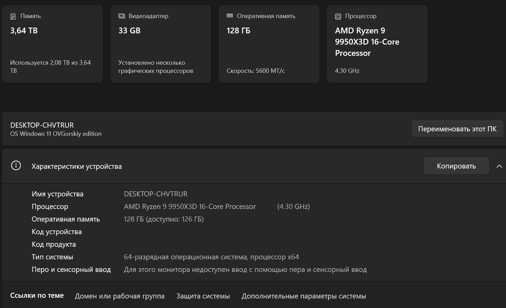

# FLUX LoRA Lab

**Reproducible local FLUX.1/FLUX.2 LoRA experimentation, failure analysis, and
ComfyUI evaluation.**

[](https://github.com/DenisGeide/flux2dev-lora-pipeline-showcase/actions/workflows/quality.yml)
[](LICENSE)
[](https://github.com/ostris/ai-toolkit)

This repository turns a private local training workspace into a safe public
engineering case study. It includes sanitized configurations, an auditable
experiment registry, dataset-manifest tooling, a path-free log parser,
reproducibility notes, failure modes, and the original project screenshots.

> The trainer is [`ostris/ai-toolkit`](https://github.com/ostris/ai-toolkit);
> this repository does not claim that third-party training loop as original
> code. Base models, LoRA weights, cached latents, optimizer states, raw
> datasets, complete raw logs, and secrets are not distributed. The screenshots
> and selected result previews below are the original project assets and are
> preserved unchanged.


## What this demonstrates

- local FLUX.1-dev and FLUX.2-dev LoRA experiment operation;
- AI-Toolkit configuration, checkpointing, quantization, and offloading;
- ComfyUI inference and fixed-prompt adapter evaluation;
- dataset curation with image/caption sidecars;
- conservative reconstruction of completed, failed, interrupted, and mixed runs;
- automatic extraction of path-free metrics from private logs;
- a reproducible protocol for future controlled comparisons;
- CUDA OOM investigation without hiding failed runs.

## Verified local evidence

The public registry was reconstructed from the local workspace on
`2026-07-25`:

| Evidence | Audited count |
|---|---:|
| Configuration records | 7 |
| Available logs | 4 |
| Curated datasets | 4 |
| Image files / caption files | 98 / 98 |
| Correctly matched image/caption pairs | 97 |
| Unmatched image / caption files | 1 / 1 |
| LoRA checkpoint files | 23 |
| Local validation generations (count only) | 56 |

One FLUX.1-dev run has a complete log, terminal checkpoint, and validation
outputs:

| Base | Dataset | Steps | Rank/alpha | LR | Last progress | Speed |
|---|---:|---:|---:|---:|---:|---:|
| `FLUX.1-dev` | 32 images, 31 matched captions | 2250 | 32/32 | `4e-4` | `2249/2250` at `01:37:45` | `2.61 s/it` |

AI-Toolkit displays the final optimization step as `2249/2250`; the following
log events record four validation generations and an unnumbered final
checkpoint. The last reported training loss was `0.2902`. It is a single
historical observation, not a benchmark.

The audit also found one image/caption filename mismatch in that historical
dataset. It is retained as a data-quality finding; future runs should correct
the sidecar name and validate the manifest before training.

The FLUX.2 records include partial checkpoints, pre-training OOM failures, and
one run folder where artifacts and the surviving retry log conflict. They are
reported without promoting them to completed experiments.

See the full [historical experiment registry](experiments/README.md) and its
machine-readable [source](experiments/registry.json).

## Start here

Choose the path that matches your goal:

| Goal | Read/run |
|---|---|
| Understand the evidence | [`experiments/README.md`](experiments/README.md) |
| Prepare your own legal dataset | [`data/README.md`](data/README.md) |
| Run a FLUX.1 baseline | [`configs/ai-toolkit-flux1dev-lora.example.yml`](configs/ai-toolkit-flux1dev-lora.example.yml) |
| Run a FLUX.2 smoke test/baseline | [`configs/ai-toolkit-flux2dev-lora.example.yml`](configs/ai-toolkit-flux2dev-lora.example.yml) |
| Reproduce the workflow | [`docs/08-reproducibility.md`](docs/08-reproducibility.md) |
| Diagnose a failed run | [`docs/09-failure-modes.md`](docs/09-failure-modes.md) |
| Review data/model boundaries | [`docs/DATA_CARD.md`](docs/DATA_CARD.md), [`docs/MODEL_CARD.md`](docs/MODEL_CARD.md) |

## Quick start

The repository tooling uses only the Python standard library:

```bash
git clone https://github.com/DenisGeide/flux2dev-lora-pipeline-showcase.git
cd flux2dev-lora-pipeline-showcase
python -m unittest discover -s tests -v
python scripts/validate_dataset_manifest.py data/dataset-manifest.example.json
python scripts/build_experiment_report.py --check
```

### 1. Prepare a dataset

Copy [`data/dataset-manifest.example.json`](data/dataset-manifest.example.json),
replace the synthetic records, and use a layout such as:

```text
my-dataset/
|-- manifest.json
|-- images/
|   |-- subject-001.webp
|   +-- subject-002.webp
+-- captions/
    |-- subject-001.txt
    +-- subject-002.txt
```

Validate metadata and files:

```bash
python scripts/validate_dataset_manifest.py my-dataset/manifest.json \
  --dataset-root my-dataset
```

### 2. Configure AI-Toolkit

Install [`ostris/ai-toolkit`](https://github.com/ostris/ai-toolkit) using its
upstream instructions, obtain authorized access to the selected base model, and
copy one public config into your private AI-Toolkit workspace.

Replace:

- `synthetic_object_token`;
- `./datasets/synthetic-object`;
- validation prompts;
- output location if necessary.

Run a 10–20-step smoke test before a long run. The historical failures show that
model preparation and transformer quantization can OOM before the first
optimization step.

The upstream CLI pattern is:

```bash
python run.py path/to/your-config.yml
```

### 3. Extract a safe report

Keep the raw trainer log private and generate a summary:

```bash
python scripts/parse_training_log.py path/to/log.txt \
  --run-id public-run-001 \
  --output reports/public-run-001.json \
  --markdown-output reports/public-run-001.md \
  --series-output reports/public-run-001.csv

python scripts/build_loss_chart.py reports/public-run-001.csv \
  --output reports/public-run-001-loss.svg \
  --title "public-run-001 training loss"
```

The output contains status, progress, loss summary, median speed, checkpoint
event counts, and OOM detection. It contains no raw lines, local paths, prompts,
trigger words, or filenames.

## Original training and dataset evidence

The following screenshots are the original files from the local project. They
show the training configuration, the running workstation, the dataset layout,
and a caption sidecar example.


## Historical runs are not an ablation

Dataset size, target, rank, learning rate, repeats, resolution, quantization,
and memory settings changed between historical runs. The registry is valuable
operational evidence, but it cannot show that one rank or learning rate caused
better output.

For a controlled comparison:

1. freeze the base model, dataset manifest, split, prompts, seeds, hardware, and software revision;
2. change one parameter;
3. collect loss, wall time, iteration speed, peak VRAM, and fixed-seed outputs;
4. review outputs blind to run ID;
5. include failed runs in the report.

Use [`configs/controlled-study.example.yml`](configs/controlled-study.example.yml)
to record that protocol.

## Selected visual results

These original result samples provide qualitative context for the project. They
are not presented as a controlled ablation or as proof that one setting is
universally better.


## Inference workflow

ComfyUI was used to load the base model, inject adapters, keep validation
prompts/seeds repeatable, and compare checkpoints.


Detailed workflow screenshot:


The workstation used for the audited local experiments:

| Component | Value |
|---|---|
| GPU | NVIDIA GeForce RTX 5090 (`32607 MiB` reported VRAM) |
| CPU | AMD Ryzen 9 9950X3D |
| RAM | 128 GB class |
| OS | Windows 11 Enterprise LTSC, build 26100 |
| Trainer | AI-Toolkit |
| Inference runtime | ComfyUI |

This is the observed environment, not a minimum requirement.




## Repository map

```text
.
|-- configs/
|   |-- ai-toolkit-flux1dev-lora.example.yml
|   |-- ai-toolkit-flux2dev-lora.example.yml
|   |-- controlled-study.example.yml
|   +-- comfyui-workflow.example.json
|-- data/
|   |-- dataset-manifest.schema.json
|   +-- dataset-manifest.example.json
|-- experiments/
|   |-- registry.json
|   +-- README.md
|-- scripts/
|   |-- parse_training_log.py
|   |-- build_experiment_report.py
|   |-- build_loss_chart.py
|   +-- validate_dataset_manifest.py
|-- tests/
|-- docs/
|-- screenshots/
|-- results/
|-- LICENSE
+-- README.md
```

## Documentation

1. [Environment and hardware](docs/01-environment-and-hardware.md)
2. [ComfyUI setup](docs/02-flux2dev-comfyui-setup.md)
3. [Inference pipeline](docs/03-inference-pipeline.md)
4. [Optimization notes](docs/04-optimization-notes.md)
5. [LoRA training workflow](docs/05-lora-training.md)
6. [Dataset preparation](docs/06-dataset-preparation.md)
7. [Evaluation and result reporting](docs/07-results.md)
8. [Reproducibility guide](docs/08-reproducibility.md)
9. [Failure modes](docs/09-failure-modes.md)
10. [Data card](docs/DATA_CARD.md)
11. [Model/adapter card](docs/MODEL_CARD.md)
12. [Attribution](docs/ATTRIBUTION.md)

## Public/private boundary

Included:

- original documentation and public scripts;
- sanitized YAML/JSON examples;
- aggregate evidence and machine-readable run metadata;
- the original workstation, model-file, ComfyUI, training, and dataset
  screenshots, restored byte-for-byte;
- the original base/LoRA comparison and result preview grid.

Excluded by `.gitignore` and release policy:

- raw source datasets and the complete caption corpus;
- `.safetensors`, `.ckpt`, `.pt`, `.pth`, `.bin`, and `.gguf`;
- cached latents and optimizer states;
- full raw output directories and complete raw training logs;
- tokens, `.env` files, local databases, and unreviewed private files;
- third-party base model files.

## Attribution and licenses

The public code, configuration examples, and original documentation are
available under the [MIT License](LICENSE).

AI-Toolkit, ComfyUI, FLUX models, datasets, and other third-party assets retain
their own licenses and terms. Review [ATTRIBUTION.md](docs/ATTRIBUTION.md) for
the exact boundary. The locally audited AI-Toolkit checkout was at revision
`35b1cde3cb7b0151a51bf8547bab0931fd57d72d`.
