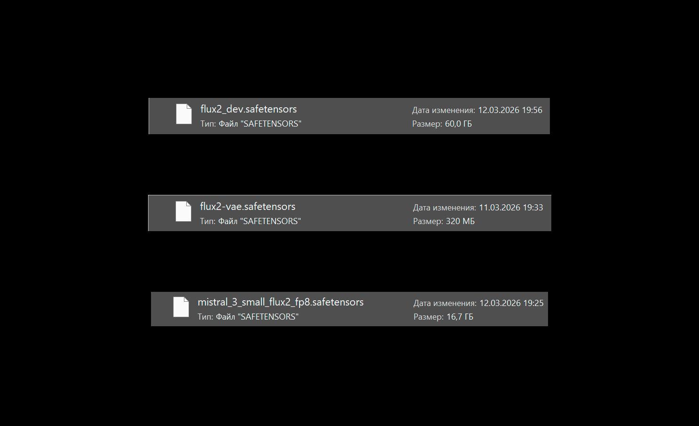
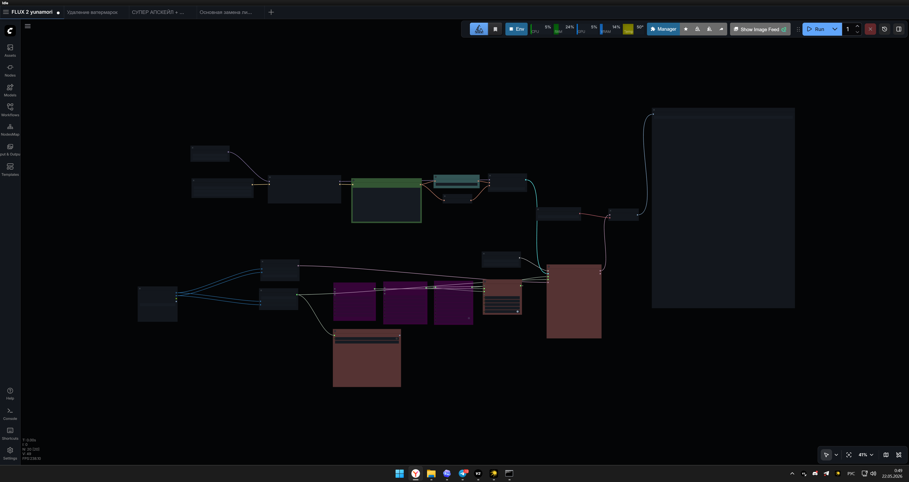
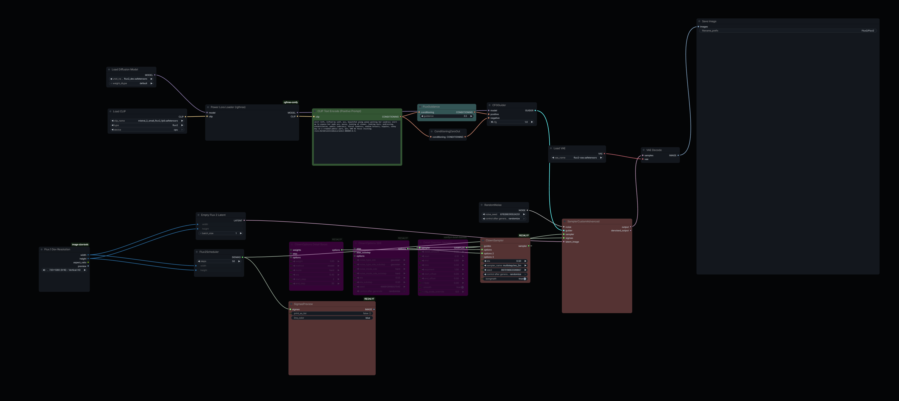

# FLUX2DEV ComfyUI Setup

This document explains the local ComfyUI setup used to run FLUX2DEV.

It is written as a practical guide to the files, placement and startup flow used in the local experiment.

## 1. Install ComfyUI

ComfyUI was used as the runtime for the FLUX2DEV inference workflow.

Official links:

- [ComfyUI GitHub](https://github.com/comfy-org/ComfyUI)
- [ComfyUI documentation](https://docs.comfy.org/)

Example setup:

```bash
git clone https://github.com/comfy-org/ComfyUI
cd ComfyUI
pip install -r requirements.txt
```

In this local setup, ComfyUI was launched through:

```text
run_nvidia_gpu.bat
```

## 2. Model Files

The model files are not included in this repository.

Used files:

| Component | File |
|---|---|
| FLUX2DEV base model | `flux2_dev.safetensors` |
| VAE | `flux2_vae.safetensors` |
| Text encoder | `mistral_3.1_small_flux2_fp8.safetensors` |

Reference:

- [FLUX.2 by Black Forest Labs](https://bfl.ai/models/flux2)



## 3. Model File Placement

Exact folder names can vary depending on the ComfyUI build and node packs. The setup follows this general structure:

```text
ComfyUI/
|-- models/
|   |-- diffusion_models/
|   |   +-- flux2_dev.safetensors
|   |-- vae/
|   |   +-- flux2_vae.safetensors
|   +-- text_encoders/
|       +-- mistral_3.1_small_flux2_fp8.safetensors
```

If your workflow expects a different folder, follow the node requirements used in your ComfyUI installation.

## 4. Import The Workflow

The workflow used in this project was based on a community FLUX2DEV workflow and then manually adapted for the local workstation.

Public workflow descriptor:

```text
configs/comfyui-workflow.example.json
```

The file describes the expected public workflow structure. The original local
workflow screenshots are included below; the JSON remains a portable example
rather than a one-click export of every local custom node.



Detailed workflow screenshot:



Both files are the unchanged screenshots from the original project and show the
actual local UI state used during experimentation.

## 5. First Generation Check

After loading the workflow:

1. Check that the model node points to `flux2_dev.safetensors`.
2. Check that the VAE node points to `flux2_vae.safetensors`.
3. Check text encoder paths.
4. Use a simple prompt.
5. Run a low-risk generation first.
6. Increase resolution/settings only after the base workflow is stable.

First-run approach:

```text
Start small -> confirm model loading -> confirm VAE decode -> then increase resolution/settings.
```

## 6. Common Setup Problems

| Problem | Possible Cause | Fix |
|---|---|---|
| Model not found | Wrong folder or filename | Verify model placement and node config |
| VAE not found | Wrong VAE path | Verify VAE folder and selected filename |
| Text encoder error | Missing or wrong text encoder file | Check text encoder node requirements |
| OOM on first run | Resolution/settings too high | Lower resolution and simplify workflow |
| Node errors | Missing custom nodes | Install required node packs |

## Public Notes

The exact custom node set can vary by ComfyUI installation and workflow version. If a reader imports a full workflow later and ComfyUI reports missing nodes, they should install the required node packs through their normal ComfyUI setup flow and re-check model, VAE and text encoder paths.
