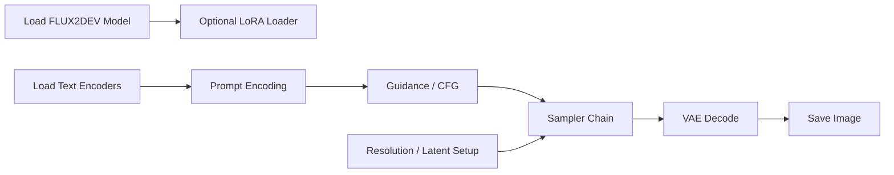
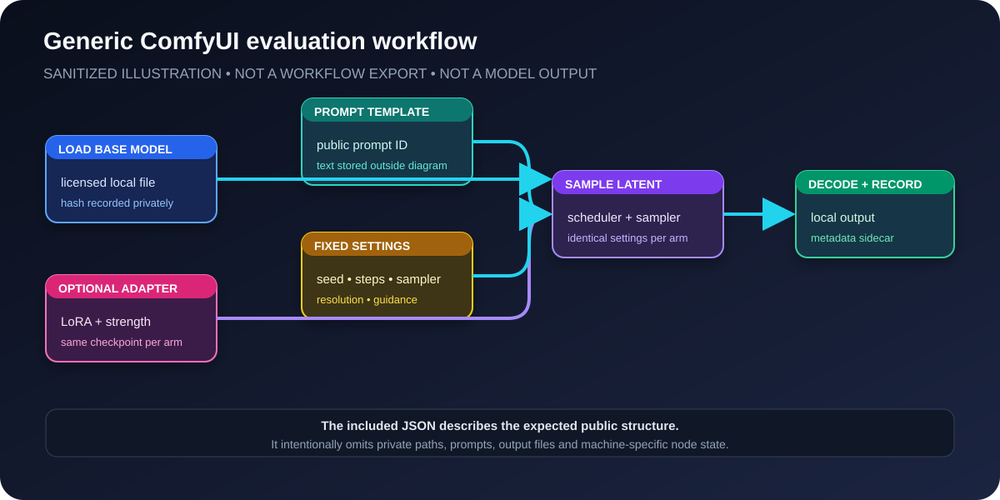
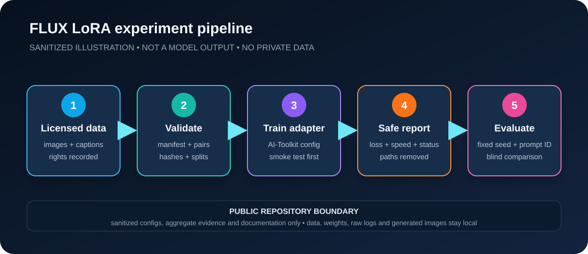

# Inference Pipeline

This document explains the FLUX2DEV inference workflow used in ComfyUI.

The workflow was based on a community FLUX2DEV setup and then adapted for local high-load generation and LoRA testing.

## Pipeline Overview





Experiment-level context:



Both SVGs are repo-native explanatory diagrams. They are not exports of the
private workflow and are not generated model images. They highlight the
following generic parts of the local generation pipeline:

- model loading;
- text encoder block;
- guidance/CFG;
- sampler chain;
- sigma/noise logic;
- VAE decode;
- LoRA injection/testing path;
- memory-sensitive nodes.

## Main Workflow Blocks

| Block | Purpose |
|---|---|
| Load Diffusion Model | Loads `flux2_dev.safetensors` |
| Load Text Encoders | Loads the text encoder stack required by the workflow |
| Power LoRA Loader | Enables LoRA testing inside the same inference workflow |
| Prompt Encode | Converts prompt text into conditioning |
| FluxGuidance / CFG | Controls guidance behavior |
| Scheduler | Defines sigma/noise schedule |
| Sampler | Generates latent output |
| VAE Decode | Converts latent output into an image |
| Save Image | Saves final generation result |

## Prompt And Conditioning

The prompt block controls what is generated and how the model interprets the request.

Areas tuned during experiments:

- positive prompt structure;
- prompt length;
- detail/style terms;
- guidance value;
- LoRA trigger words when LoRA was used.

Safe synthetic prompt shape:

```text
synthetic_object, abstract geometry, neutral background, clean composition
```

The real prompts remain private. The important part is keeping a versioned
prompt ID, target description, and quality/style terms consistent enough to
compare base FLUX2DEV output against LoRA output.

## Sampler And Scheduler

The sampler/scheduler chain was one of the main areas of manual tuning.

Goals:

- reduce unstable outputs;
- improve detail retention;
- control noise behavior;
- keep generation stable at higher resolutions;
- avoid unnecessary memory pressure.

Representative values used in the public example config:

```text
Sampler: flowmatch / custom ComfyUI sampler chain
Scheduler: flowmatch-style FLUX scheduler
Steps: 20 for training samples; adjusted per inference run
Guidance/CFG: 1 in the AI-Toolkit sample config; adjusted per ComfyUI test
Resolution: 768x768 for training samples; custom ratios for final inference tests
Batch size: 1
```

Note: exact generation values can vary per experiment. For this showcase, it is better to document the workflow structure and show representative settings than to present one fixed recipe as universally optimal.

## VAE Handling

The workflow uses:

```text
flux2_vae.safetensors
```

The VAE stage converts latent output into the final visible image.

Possible issues in this stage:

- wrong VAE file;
- poor decode quality;
- extra memory pressure;
- output mismatch if the VAE is not aligned with the model setup.

## LoRA-Ready Configuration

The inference workflow was kept LoRA-ready so trained LoRA models could be tested without rebuilding the entire pipeline.

This makes it possible to compare:

- base FLUX2DEV output;
- early LoRA output;
- final LoRA output;
- different LoRA strengths;
- different trigger words.

## Why This Matters

For this project, the ComfyUI workflow is not just a visual graph. It is the main control layer for:

- model loading;
- memory behavior;
- prompt conditioning;
- sampler behavior;
- LoRA evaluation;
- repeatable local testing.

## Reproducibility Note

The workflow is documented as a working structure rather than a fixed one-click recipe. FLUX2DEV inference settings depend on the target GPU, output resolution, LoRA strength and prompt behavior.
