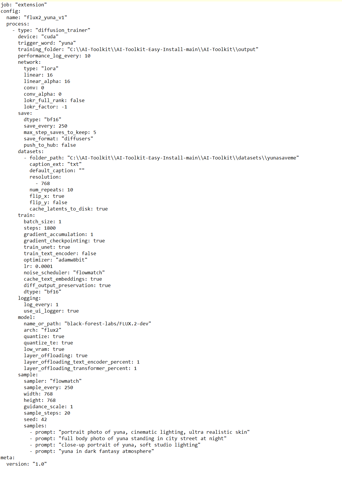
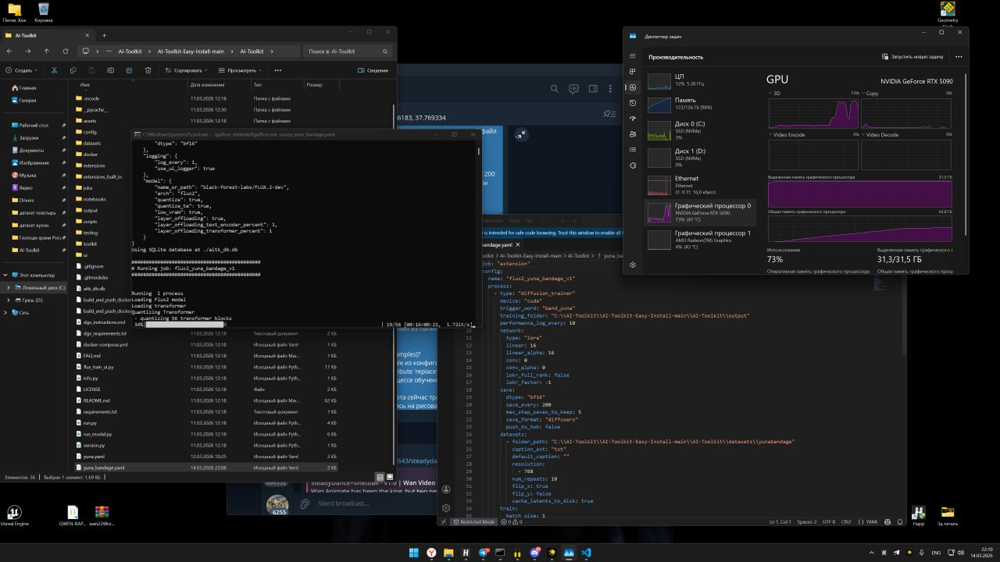

# LoRA Training Workflow

This document describes the LoRA training workflow used for FLUX2DEV.

The training was performed with [AI-Toolkit](https://github.com/ostris/ai-toolkit), using FLUX2DEV as the base model.

## Training Summary

| Item | Value |
|---|---|
| Training framework | AI-Toolkit |
| Base model | FLUX2DEV |
| Base model file | `flux2_dev.safetensors` |
| Dataset size | approximately 20-35 images |
| Captions | `.txt` sidecar files |
| Training time | around 6-7 hours |
| Main issue | memory pressure / OOM |
| Main fix | custom training config and memory balancing |
| LoRA weights | not published |

## Configuration Philosophy

The training config is presented as a working experiment baseline, not as a universal recipe.

Exact low-level values changed during experiments. FLUX2DEV LoRA training is sensitive to the GPU, dataset size, captions/trigger words, target style and memory behavior of a particular run.

This repository documents:

- the structure of a working local training setup;
- the memory strategy used to make training stable enough;
- the types of settings that mattered;
- the result comparison process.

It does not claim that the same values are optimal for every dataset or machine.

## Why Training Needed Custom Tuning

FLUX2DEV is a heavy local training workload.

During LoRA training, memory pressure can appear during:

- forward pass;
- attention calculation;
- latent caching;
- optimizer updates;
- higher resolution batches;
- longer training sessions.

In this project, the training pipeline had to be stabilized manually instead of relying only on default presets.

## Training Pipeline

```mermaid
flowchart LR
    Dataset["Prepared Dataset"] --> Captions["Captions / Trigger Words"]
    Captions --> Config["AI-Toolkit Training Config"]
    Config --> Base["FLUX2DEV Base Model"]
    Base --> Train["LoRA Training"]
    Train --> Checkpoints["LoRA Checkpoints"]
    Checkpoints --> Test["ComfyUI Inference Test"]
    Test --> Results["Result Comparison"]
```



Training config screenshot:



Training log capture:



## Configuration Areas

The table below shows one working local training baseline extracted from the sanitized config example.

| Setting | Value |
|---|---|
| LoRA rank | 16 |
| LoRA alpha | 16 |
| Optimizer | `adamw8bit` |
| Learning rate | `0.0001` |
| Batch size | 1 |
| Gradient accumulation | 1 |
| Resolution | 768 |
| Steps | 1800 |
| Training dtype | `bf16` |
| Noise scheduler | `flowmatch` |
| Gradient checkpointing | enabled |
| Text encoder training | disabled |
| Quantization | enabled for model/text encoder in the training config |
| Low VRAM mode | enabled |
| Layer offloading | enabled |

Public config:

```text
configs/ai-toolkit-flux2dev-lora.example.yml
```

These values came from a working config used locally. Other datasets and hardware may require different values.

## Main Training Problems

| Problem | Description |
|---|---|
| OOM | Training crashed when memory pressure exceeded available VRAM |
| Instability | Some configs were not stable across longer runs |
| Slow iteration | Failed runs increased the time needed to find a working config |
| Dataset sensitivity | Small datasets require careful filtering and trigger-word control |

## Stabilization Work

The training workflow was stabilized through:

- custom config tuning;
- memory balancing;
- reduced unnecessary memory pressure;
- FP8-related optimization where applicable;
- dataset cleanup;
- testing intermediate LoRA outputs;
- adjusting trigger words per target.

## Testing LoRA During Training

The trained LoRA was tested inside the ComfyUI inference workflow.

Testing focused on:

- identity/style consistency;
- detail retention;
- texture quality;
- prompt accuracy;
- artifact reduction;
- LoRA strength behavior.

## What Is Not Published

The repository does not publish:

- final LoRA weights;
- private model files;
- unsafe training assets;
- private local paths;
- full machine-specific config.

## Result Evidence

The training workflow is evaluated through:

- training logs where available;
- intermediate samples;
- base FLUX2DEV vs trained LoRA comparison;
- final result grid;
- notes about artifacts, consistency and prompt alignment.
