# LoRA training workflow

LoRA training was executed with
[`ostris/ai-toolkit`](https://github.com/ostris/ai-toolkit). AI-Toolkit provides
the trainer; this repository provides sanitized configuration, experiment
operation, evidence extraction, failure analysis, and evaluation guidance.

## Audited evidence

| Item | Value |
|---|---|
| Base-model families | FLUX.1-dev and FLUX.2-dev |
| Sanitized configuration records | 7 |
| Available local logs | 4 |
| Private datasets | 4 |
| Image files / caption files | 98 / 98 |
| Correctly matched pairs | 97 (one image and one caption were unmatched) |
| Local LoRA checkpoint files | 23 |
| Local validation images | 56 |
| Public model/adapter weights | none |

One FLUX.1-dev run has unambiguous completion evidence:

| Setting/observation | Value |
|---|---:|
| Dataset | 32 images, 31 matched caption sidecars |
| Resolution buckets | 768, 1024 |
| LoRA rank/alpha | 32/32 |
| Convolution rank/alpha | 16/16 |
| Steps | 2250 |
| Optimizer | `adamw8bit` |
| Learning rate | `4e-4` |
| Batch / accumulation | 1 / 1 |
| Dtype | `bf16` |
| Last progress event | `2249/2250` at `01:37:45` |
| Last reported speed | `2.61 s/it` |
| Last reported loss | `0.2902` |
| Completion evidence | final checkpoint event after validation sampling |

The progress counter is zero-indexed: the last optimization event appears as
`2249/2250`. The log then records four validation generations and an unnumbered
final checkpoint.

One image in the historical training directory did not have a same-stem
caption; a differently named caption was also present. AI-Toolkit could fall
back to the configured trigger/default behavior, but the exact per-item effect
is not reconstructed. This is recorded as a data-quality limitation.

See [`experiments/README.md`](../experiments/README.md) for every run and the
conservative status rules.

## Pipeline

```mermaid
flowchart LR
    Rights["Rights/licensing review"] --> Data["Images + caption sidecars"]
    Data --> Manifest["Versioned dataset manifest"]
    Manifest --> Smoke["10–20-step smoke test"]
    Smoke --> Train["AI-Toolkit LoRA training"]
    Train --> Checkpoints["Immutable checkpoints"]
    Checkpoints --> Evaluate["Fixed prompts + seeds in ComfyUI"]
    Evaluate --> Report["Sanitized metrics + failure report"]
```

## Public configuration

- [`configs/ai-toolkit-flux1dev-lora.example.yml`](../configs/ai-toolkit-flux1dev-lora.example.yml)
  is shaped from the completed FLUX.1 run. Paths, identity, trigger token, and
  prompts are sanitized; seed walking is disabled for comparable validation.
- [`configs/ai-toolkit-flux2dev-lora.example.yml`](../configs/ai-toolkit-flux2dev-lora.example.yml)
  is informed by historical FLUX.2 attempts. The local audit does not contain a
  clean, complete FLUX.2 log, so run a smoke test and do not call it universally
  proven.

## What historical runs showed

Three available logs ended in CUDA OOM before the first reported training step:

- two during transformer quantization;
- one after model/VAE loading during model preparation.

Three other run folders retain numbered checkpoints but no complete log or final
adapter. One folder contains a final adapter and an OOM log that likely belong
to different attempts/retries. This is why run folders must use immutable IDs
and why checkpoint presence alone is not treated as completion.

See [failure modes](09-failure-modes.md) for the triage order.

## Safe experiment operation

1. Validate the dataset manifest and rights.
2. Copy the final config into a new immutable run directory.
3. Record AI-Toolkit revision, Python packages, GPU, and driver.
4. Run a 10–20-step smoke test at the intended resolution.
5. Keep prompt IDs and validation seeds fixed.
6. Preserve the raw log privately.
7. Generate a path-free report with `scripts/parse_training_log.py`.
8. Record failures and partial checkpoints instead of deleting them.

## Evaluation

Training loss is useful for diagnosing optimization, but it is not a perceptual
quality metric. Compare checkpoints with:

- held-out compositions;
- fixed prompts and seeds;
- subject fidelity;
- prompt adherence;
- anatomy/geometry;
- background leakage;
- visible artifacts;
- blinded review when making a comparative claim.

The repository does not distribute the historical generated images. Its SVGs
are illustrative protocol diagrams only. Future experiments should use
[`configs/controlled-study.example.yml`](../configs/controlled-study.example.yml)
before using the term “ablation”.

## Not published

- base-model files;
- LoRA weights and optimizer states;
- source photographs and private captions;
- cached latents;
- raw logs containing paths/identifiers;
- generated images without explicit release rights and complete run metadata;
- tokens, local databases, and machine-specific state.

See the [model card](MODEL_CARD.md), [data card](DATA_CARD.md), and
[attribution](ATTRIBUTION.md) for license boundaries.
