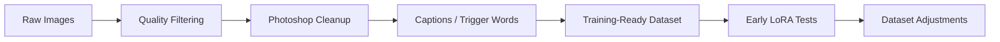
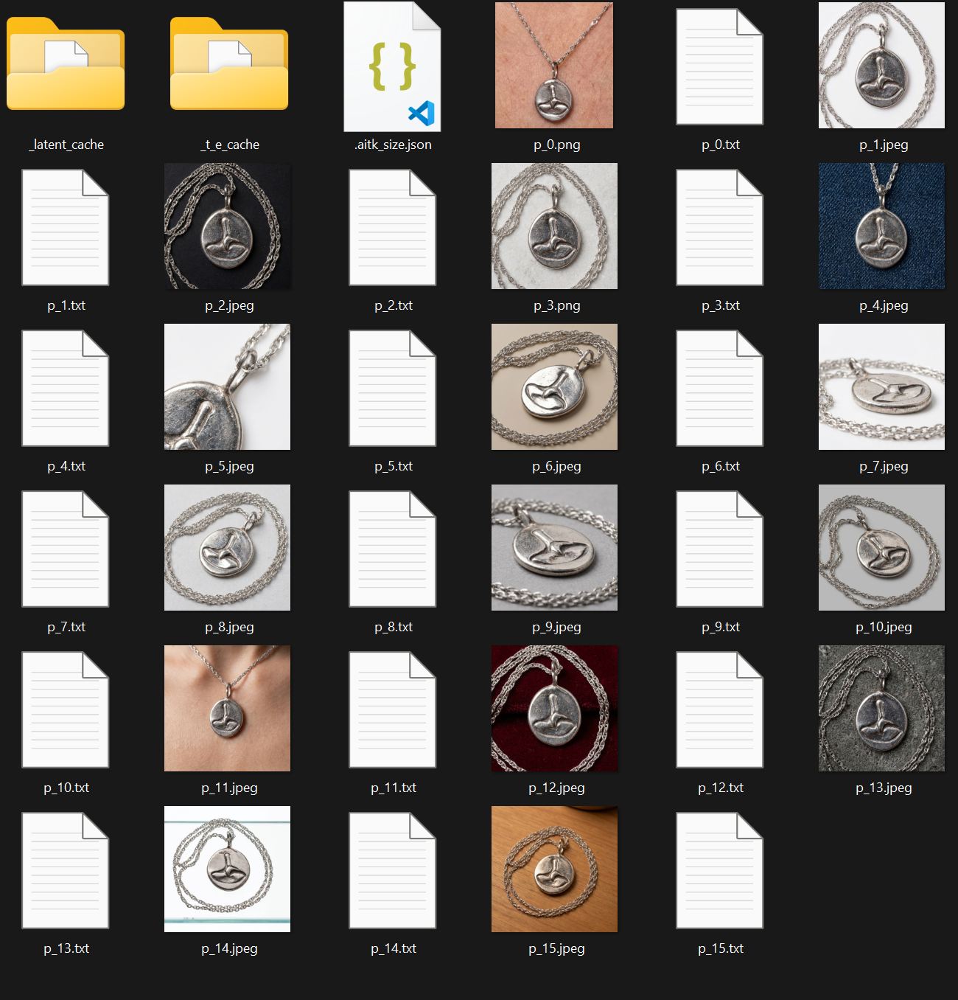
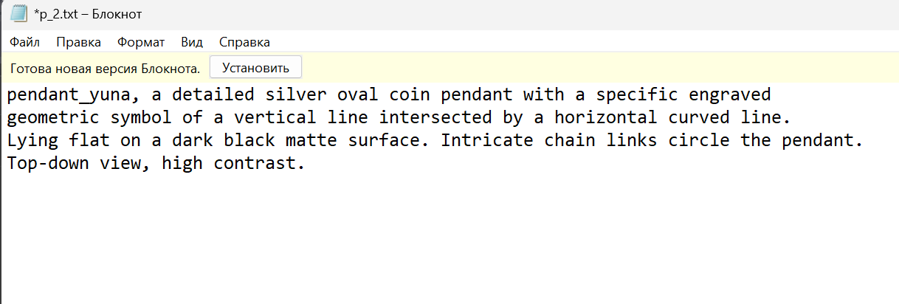

# Dataset Preparation

This document describes the dataset preparation process used before LoRA training.

The exact dataset can vary depending on the LoRA target, but the general preparation logic is the same: clean inputs, consistent target, useful trigger words and early validation through test generations.

## Dataset Summary

| Item | Value |
|---|---|
| Historical dataset sizes | 16, 16, 32, and 34 images |
| Sidecar audit | 97 matched pairs; 1 unmatched image and 1 unmatched caption |
| Editing tool | Photoshop |
| Captions | `.txt` sidecar files next to images |
| Trigger words | selected per LoRA target |
| Validation | manual visual validation through sample generations |
| Public dataset files | not included; schema and synthetic manifest example only |

## Preparation Flow



## 1. Collect Source Images

The first step is collecting images that represent the target subject or style.

Useful variety:

- different angles;
- different lighting;
- different framing;
- enough consistency to avoid confusing the model;
- enough variation to avoid overfitting.

## 2. Remove Low-Quality Images

Images were removed when they were:

- blurry;
- too compressed;
- visually noisy;
- duplicated;
- inconsistent with the target;
- likely to introduce unwanted artifacts.

## 3. Clean Images

Photoshop was used for manual cleanup.

Typical cleanup work:

- removing visual noise;
- cropping;
- fixing obvious defects;
- improving consistency;
- preparing cleaner training inputs.

## 4. Captions And Trigger Words

Captioning strategy can vary per dataset.

In this project, captions were stored as `.txt` sidecar files next to the images, and trigger words were selected per LoRA target.

Safe synthetic example:

```text
trigger_word: synthetic_object
caption example: synthetic_object, abstract geometry, neutral background
```

Example folder structure:

```text
dataset/
|-- image_001.png
|-- image_001.txt
|-- image_002.png
|-- image_002.txt
+-- ...
```

For public examples, `synthetic_object_token` is used as a safe placeholder.
Replace it with the target trigger word in a real private/local training run.

## 5. Training-Ready Dataset

Before training, the dataset was checked for:

- consistent naming;
- matching image/caption pairs if captions are used;
- safe image content;
- no private/copyright-sensitive files in the public examples;
- no local metadata that should remain private.



Caption sidecar example:



These are the unchanged documentation screenshots from the original project.
The repository does not include the raw training-image directory or complete
caption corpus.

## Manifest and validation

Document every released record with
[`data/dataset-manifest.schema.json`](../data/dataset-manifest.schema.json) and
validate it before training:

```bash
python scripts/validate_dataset_manifest.py path/to/manifest.json \
  --dataset-root path/to/dataset
```

The manifest captures rights, license, split, relative paths, dimensions, and
optional hashes. See the complete [data card](DATA_CARD.md).

## Public dataset note

The diagram illustrates preparation, but it is not a redistributable training
corpus. Private source images, captions, sensitive personal data, hidden
metadata, and local folder paths remain outside this repository.

## Dataset Quality Notes

Small LoRA datasets are sensitive. The goal is not to collect as many images as possible, but to keep the target consistent while preserving enough variation for useful generalization.

Published dataset examples are kept separate from private training material.
