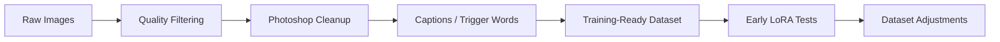

# Dataset Preparation

This document describes the dataset preparation process used before LoRA training.

The exact dataset can vary depending on the LoRA target, but the general preparation logic is the same: clean inputs, consistent target, useful trigger words and early validation through test generations.

## Dataset Summary

| Item | Value |
|---|---|
| Dataset size | approximately 20-35 images |
| Editing tool | Photoshop |
| Captions | `.txt` sidecar files next to images |
| Trigger words | selected per LoRA target |
| Validation | manual visual validation through sample generations |
| Public dataset examples | safe/owned images only |

## Preparation Flow



## 1. Collect Source Images

The first step is collecting images that represent the target subject or style.

Useful variety:

- different angles;
- different lighting;
- different framing;
- enough consistency to avoid confusing the model;
- enough variation to avoid overfitting.

## 2. Remove Low-Quality Images

Images were removed when they were:

- blurry;
- too compressed;
- visually noisy;
- duplicated;
- inconsistent with the target;
- likely to introduce unwanted artifacts.

## 3. Clean Images

Photoshop was used for manual cleanup.

Typical cleanup work:

- removing visual noise;
- cropping;
- fixing obvious defects;
- improving consistency;
- preparing cleaner training inputs.

## 4. Captions And Trigger Words

Captioning strategy can vary per dataset.

In this project, captions were stored as `.txt` sidecar files next to the images, and trigger words were selected per LoRA target.

Safe example:

```text
trigger_word: example_trigger
caption example: portrait photo of example_trigger, cinematic lighting, realistic detail
```

Example folder structure:

```text
dataset/
|-- image_001.png
|-- image_001.txt
|-- image_002.png
|-- image_002.txt
+-- ...
```

For public examples, `example_trigger` is used as a safe placeholder. Replace it with the target trigger word in a real private/local training run.

## 5. Training-Ready Dataset

Before training, the dataset was checked for:

- consistent naming;
- matching image/caption pairs if captions are used;
- safe image content;
- no private/copyright-sensitive files in the public examples;
- no local metadata that should remain private.


Caption/trigger example:


## Public Dataset Note

The public dataset examples are limited to safe showcase material. Private source images, copyrighted references, sensitive personal data, hidden metadata and local folder paths are outside the scope of this repository.

## Dataset Quality Notes

Small LoRA datasets are sensitive. The goal is not to collect as many images as possible, but to keep the target consistent while preserving enough variation for useful generalization.

Published dataset examples are kept separate from private training material.
