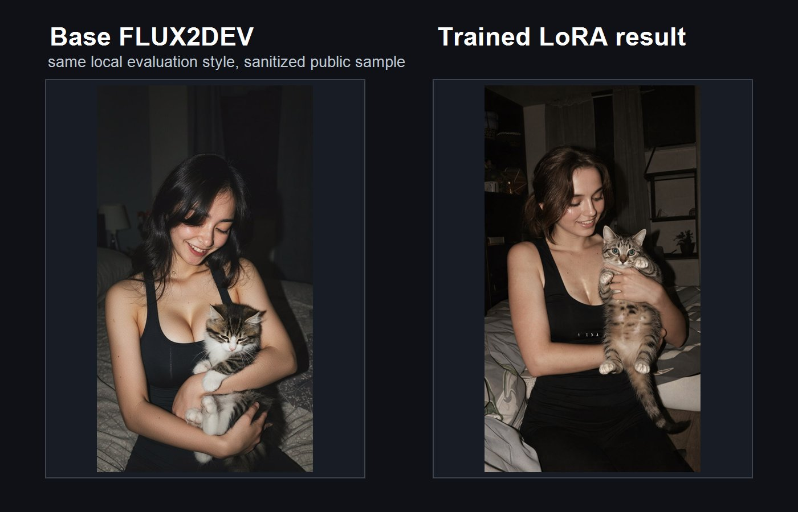
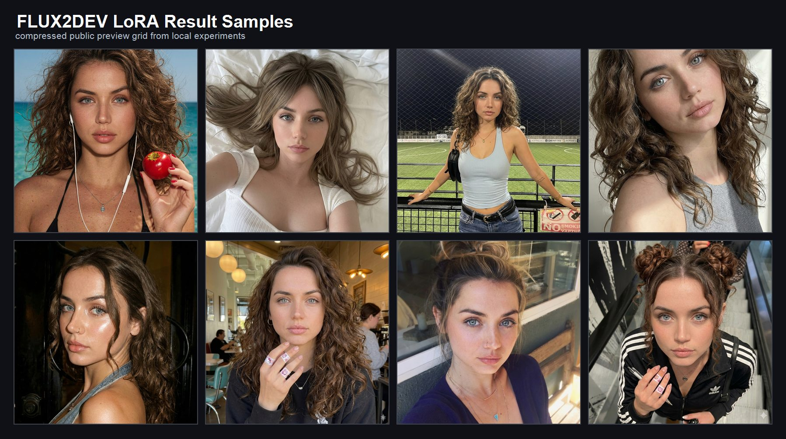

# Evaluation and result reporting

This repository includes the original public comparison sheet and result grid
from the local project. They provide qualitative context, but their exact
run-to-image mapping is not complete enough to support a controlled
matched-seed or ablation claim. The registry therefore keeps those claims
separate from the audited run status.

## Base model and LoRA comparison

This is the original project comparison image. Treat it as a qualitative
demonstration, not an isolated causal measurement of one configuration change.

## Result samples

## Evidence-driven status

Surviving logs and checkpoints are mapped conservatively to `completed`,
`interrupted`, `failed_oom`, or `mixed_evidence`. The images above do not
override that classification or replace the machine-readable
[experiment registry](../experiments/registry.json).

## Evaluation focus

Future generated results should be evaluated through engineering-oriented
criteria:

- prompt alignment;
- detail retention;
- texture quality;
- visual consistency;
- visible artifacts;
- stable behavior across repeated local tests.

## Result context

The exact generation settings changed during historical experiments. The
repository therefore does not present these images as proof that one
sampler/configuration is optimal.

The repeatable workflow is:

1. prepare and clean a licensed dataset;
2. train LoRA through AI-Toolkit;
3. test LoRA inside the ComfyUI workflow;
4. compare base output against LoRA output locally;
5. keep the configuration stable enough for repeated evaluation;
6. publish images only when rights and run provenance are explicit.

Future runs should preserve model/checkpoint hash, prompt ID, seed, sampler, and
generation settings with every image. See the
[controlled-study protocol](../configs/controlled-study.example.yml).
