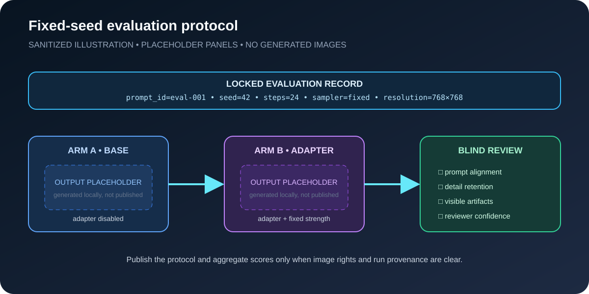
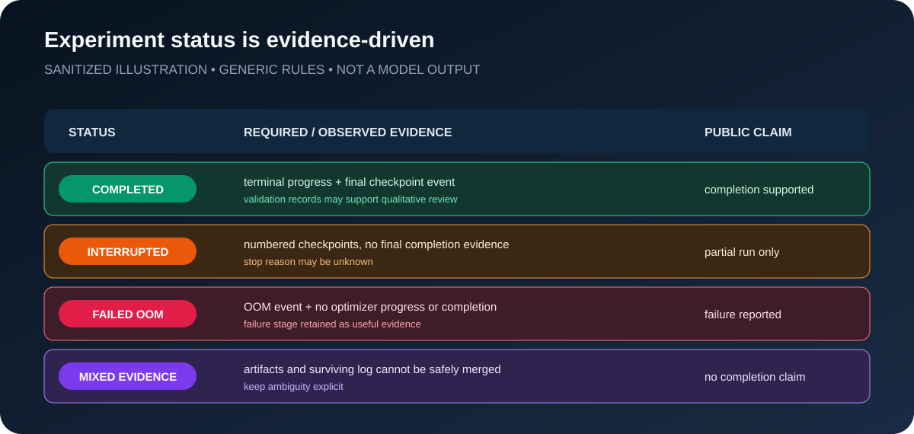

# Evaluation and result reporting

Historical generated images are not distributed in this repository. Their
source-image rights and exact run-to-image mapping were not documented well
enough for a responsible public release or a controlled matched-seed claim.
The registry therefore publishes aggregate counts and conservative run status,
while the diagrams below explain how future results should be evaluated.

## Fixed-seed comparison

This repo-native SVG contains placeholder panels only. It is not a base-model
image, an adapter output, or a public result grid.

## Evidence-driven status

This schematic explains how the repository maps surviving logs and checkpoints
to `completed`, `interrupted`, `failed_oom`, or `mixed_evidence`. It does not
replace the machine-readable [experiment registry](../experiments/registry.json).

## Evaluation focus

Future generated results should be evaluated through engineering-oriented
criteria:

- prompt alignment;
- detail retention;
- texture quality;
- visual consistency;
- visible artifacts;
- stable behavior across repeated local tests.

## Result context

The exact generation settings changed during historical experiments. The
repository therefore does not publish those images as proof that one
sampler/configuration is optimal.

The repeatable workflow is:

1. prepare and clean a licensed dataset;
2. train LoRA through AI-Toolkit;
3. test LoRA inside the ComfyUI workflow;
4. compare base output against LoRA output locally;
5. keep the configuration stable enough for repeated evaluation;
6. publish images only when rights and run provenance are explicit.

Future runs should preserve model/checkpoint hash, prompt ID, seed, sampler, and
generation settings with every image. See the
[controlled-study protocol](../configs/controlled-study.example.yml).
